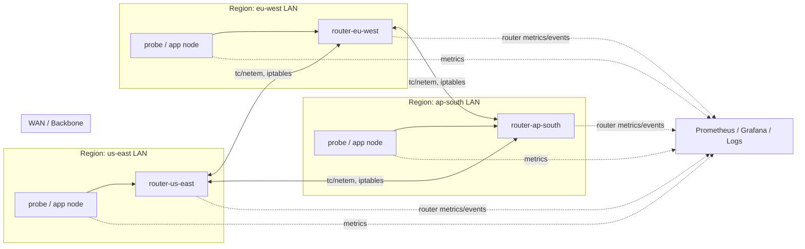
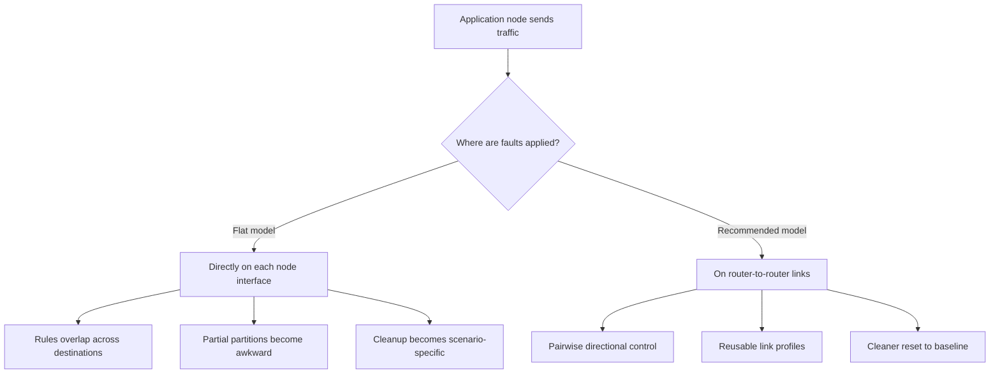
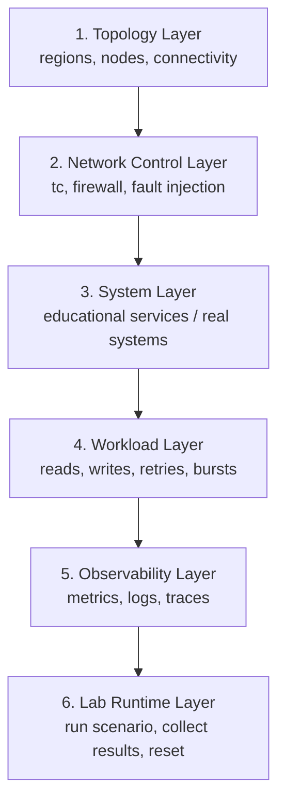
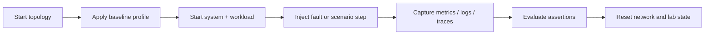
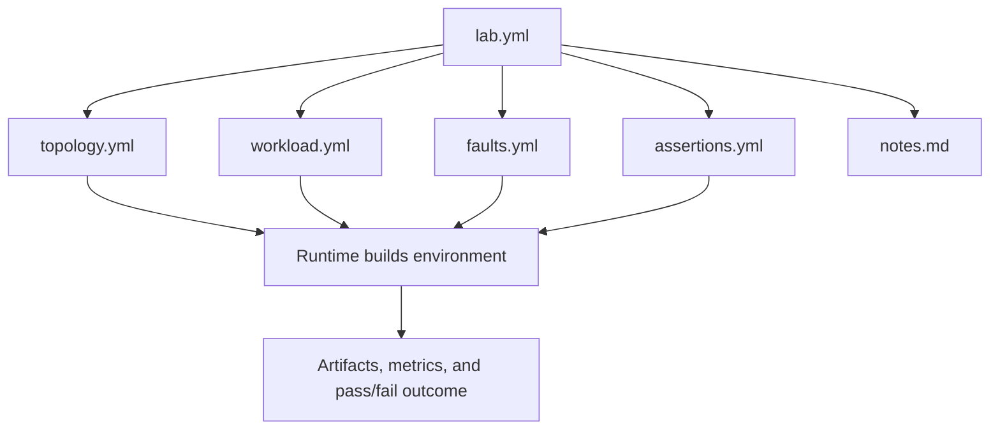

# Architecture

## At a Glance



## Verdict

Your proposed approach is feasible, but the raw form is too flat for a lab platform.

`Docker Compose + tc + Pumba + iptables` is a good foundation for a learning environment on one machine. It can demonstrate a large amount of distributed systems behavior. The main issue is that a single shared Docker bridge with ad hoc per-container network shaping becomes hard to reason about once you want:

- directional latency
- pairwise region links
- partial partitions
- reproducible scenarios
- multiple labs sharing the same platform

If you build the first version that way, it will work. If you keep building on it, it will turn into scenario-specific shell scripts that are hard to maintain.

## Critical Assessment

### What this setup does well

- Demonstrates WAN latency, loss, jitter, reordering, corruption, and constrained bandwidth.
- Demonstrates crash-stop failures, pauses, slow nodes, and workload bursts.
- Demonstrates leader election, quorum loss, replication lag, conflict resolution, and anti-entropy.
- Lets you run real systems such as `etcd`, `Redis`, `Cassandra`, and `CockroachDB` under repeatable faults.
- Makes concepts visible with metrics and traces.

### What this setup does poorly

- All nodes share one physical host, one kernel, and usually one clock source.
- "Region failure" is still host-local emulation, not independent failure domains.
- Disk failures are not realistic unless you model them at the application layer.
- Clock skew and time anomalies are possible to fake, but fidelity is weaker than network emulation.
- Large clusters of heavyweight databases will be resource-limited on a laptop.

### Main design risk in the current idea

Applying `tc` directly on each node container is fine for a demo, but it does not naturally model a graph of links.

Example problem:

- If `node-us-east` talks to both `node-eu` and `node-ap`, one interface-level `tc` rule affects all egress unless you add filters and classes.
- Partial partitions become awkward.
- Asymmetric rules become messy.
- Resetting scenarios cleanly becomes error-prone.

### Recommended fix

Introduce explicit regional routers.

Each region gets:

- a local subnet
- one router container connected to the local subnet and to the WAN backbone
- application nodes attached to the local subnet

Then shape traffic on router-to-router links, not directly on every application container.

That gives you:

- clearer topology
- per-link and directional control
- easier partition rules
- reusable network profiles
- cleaner mental model for learners

### Why routers improve the model



## Recommended Platform Layers



### 1. Topology Layer

Defines the regions, nodes, and connectivity graph.

Responsibilities:

- create Docker networks for regional LANs and WAN/backbone
- attach nodes to regional LANs
- attach routers to both LAN and WAN
- define named topologies such as `3-region`, `5-region`, `star`, `ring`, `mesh`

### 2. Network Control Layer

Applies network conditions and faults.

Responsibilities:

- add delay, jitter, loss, reordering, duplication, and rate limits
- block traffic for full or partial partitions
- create asymmetric faults
- restore baseline state after a scenario

Preferred tools:

- `tc netem` for delay, jitter, loss, reorder, duplicate, corruption
- `tc tbf` or `htb` for bandwidth shaping
- `iptables` or `nft` for partitions and directional drops
- `Pumba` for convenient stop, kill, pause, stress, and some network actions

Critical note:

- Use `Pumba` as a helper, not as the only abstraction.
- For a scalable lab platform, keep a thin controller that applies faults declaratively.

### 3. System Layer

Runs the actual distributed system being studied.

Examples:

- custom educational services
- `etcd`
- `Redis`
- `Cassandra`
- `CockroachDB`
- `ZooKeeper`

Recommendation:

- Start with small custom services and `etcd`.
- Add heavier databases later.
- Do not begin with `Cassandra` and `CockroachDB` as the first milestone unless you have substantial host resources.

### 4. Workload Layer

Generates traffic and user actions.

Responsibilities:

- issue reads and writes
- create concurrent operations
- simulate retries and client timeouts
- drive load profiles such as burst, steady, or hotspot

### 5. Observability Layer

This is mandatory, not optional.

Responsibilities:

- collect node and container metrics
- expose application-level metrics
- track replication lag, convergence time, failover time, stale read rate, conflict rate, queue depth, retry volume
- visualize scenarios and timeline events

Recommended stack:

- Prometheus
- Grafana
- Loki or plain structured logs
- OpenTelemetry traces for the custom services

### 6. Lab Runtime Layer

Turns the platform into teachable labs instead of a pile of scripts.

Responsibilities:

- start topology
- apply baseline network profile
- run workload
- inject faults
- collect metrics
- evaluate expected outcomes
- reset state

This is where extensibility comes from.

### End-to-end lab flow



## Recommended Project Structure

When you begin implementation, use a structure like this:

```text
compose/
  base.yml
  observability.yml
  topologies/
    3-region.yml
    5-region.yml
    mesh.yml
    star.yml

controller/
  cli/
  engine/
  adapters/
    docker.py
    tc.py
    firewall.py
    pumba.py

profiles/
  latency/
    us-eu-ap.yml
    high-jitter.yml
    lossy-wan.yml
  faults/
    partition-minority.yml
    asymmetric-drop.yml
    slow-link.yml
    brownout.yml

labs/
  00-network-basics/
  10-replication/
  20-consensus/
  30-sharding/
  40-streams/
  50-chaos/
  60-observability/

services/
  kv-store/
  raft-demo/
  vector-clock-demo/
  crdt-demo/
  external/
    etcd/
    redis/
    cassandra/
    cockroach/

workloads/
  clients/
  traces/

observability/
  prometheus/
  grafana/
  dashboards/

docs/
  architecture.md
  lab-catalog.md
  implementation-plan.md
```

## Lab Contract

Every lab should follow the same contract.



Example lab contents:

```text
labs/10-replication/eventual-consistency/
  lab.yml
  topology.yml
  workload.yml
  faults.yml
  assertions.yml
  notes.md
```

Suggested fields for `lab.yml`:

- `name`
- `objective`
- `systems`
- `topology`
- `baseline_profile`
- `workload`
- `faults`
- `metrics`
- `assertions`
- `reset_policy`
- `estimated_runtime`

That makes labs reproducible and scriptable.

## Recommended Topology Model

Use a region-based design, not direct full-mesh links between app containers.

### Baseline topology

- `region-us-east`
- `region-eu-west`
- `region-ap-south`

Each region contains:

- `router-<region>`
- one or more system nodes
- optional local client

Traffic model:

- intra-region traffic: near-zero latency or very low latency
- inter-region traffic: shaped on router-to-router paths

This lets you simulate:

- "local reads, remote replication"
- regional failover
- majority/minority partitions
- asymmetric partitions
- degraded transoceanic links

## Technology Choices

## Compose vs Kubernetes

Use Docker Compose first.

Why:

- lower cognitive load
- better for a single-host educational platform
- simpler inspection and reset
- easier to script around

Move to Kubernetes only if the goal becomes "teaching Kubernetes-native distributed systems operations." That is a separate concern.

## Pumba vs custom control

Use both.

- Pumba is useful for simple node and container chaos.
- A custom controller is better for repeatable lab orchestration and precise network state transitions.

If you rely only on shell scripts plus Pumba, you will accumulate operational debt quickly.

## iptables vs nftables

If you are comfortable with `iptables`, it is acceptable. Be aware that many modern systems use nftables underneath.

For the first version:

- keep the controller interface generic as "firewall rules"
- hide the backend command choice behind an adapter

That way you can start with `iptables` and switch later if needed.

## Phased System Selection

Do not start with all target systems at once.

Recommended order:

1. Custom HTTP key-value store with pluggable replication modes
2. `etcd` for Raft and quorum labs
3. `Redis` for leader-follower and async replication labs
4. `Cassandra` for tunable consistency and gossip
5. `CockroachDB` for distributed SQL and transaction-focused labs

This order minimizes platform risk while preserving educational value.

## Non-Negotiable Design Rules

- Keep topology, workloads, and faults declarative.
- Make every lab resettable.
- Treat observability as a core feature.
- Separate the teaching service implementations from the orchestration layer.
- Do not hard-code one distributed system into the platform.
- Prefer region routers over ad hoc per-node traffic shaping.
- Measure actual observed RTT and throughput in every lab before trusting the configured impairment.

## Feasibility Conclusion

This project is feasible and worth building.

The approach becomes a durable lab platform if you:

- treat networking as a modeled topology rather than one flat bridge
- use a controller for repeatable scenarios
- start with lightweight educational services
- add heavyweight real systems only after the platform is stable

If you skip those constraints, the first demos will work, but adding labs later will be painful.
