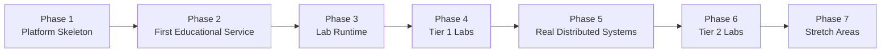
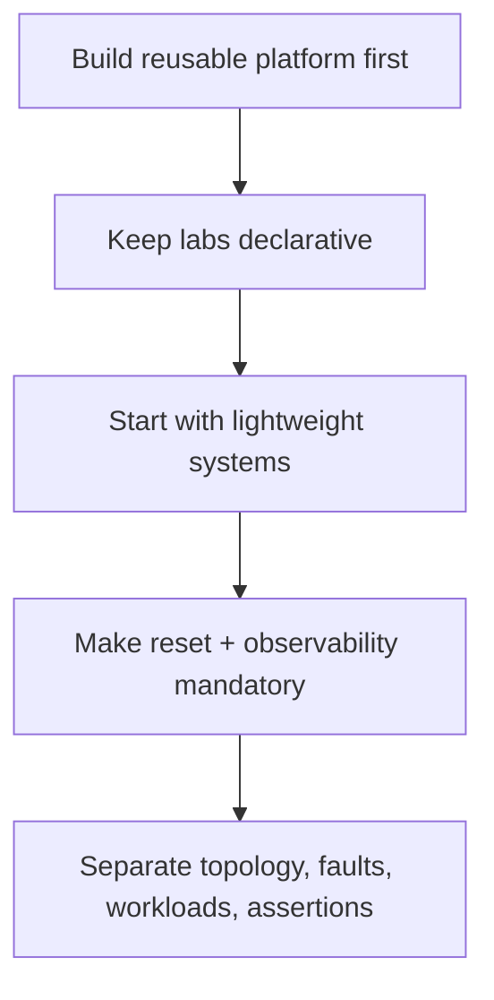
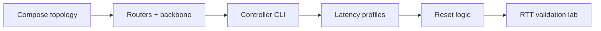
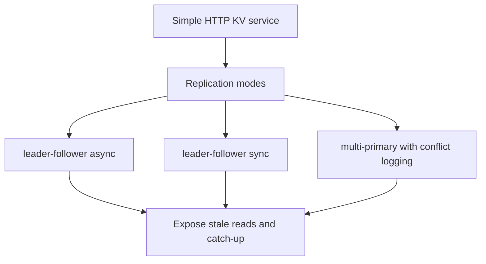
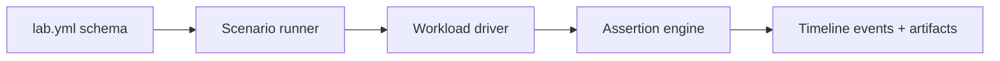
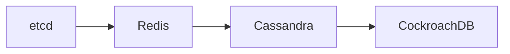
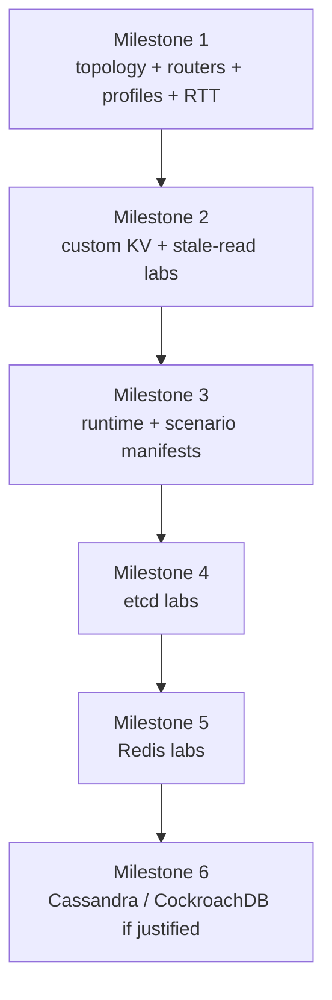

# Implementation Plan

## Goal

Build a local lab platform that can run repeatable distributed systems experiments on one machine, with room to add many labs later without rewriting the core.

## Roadmap Overview

## Principles

- build the platform before adding many systems
- keep labs declarative
- prefer lightweight demo services first
- make reset and observability part of the first milestone
- separate topology, faults, workloads, and assertions

## Phase 1: Platform Skeleton

Objective:

Create the reusable substrate.

Deliverables:

- Docker Compose topology with three regions
- one router container per region
- one WAN/backbone network
- Prometheus and Grafana
- controller CLI with commands like `up`, `down`, `reset`, `apply-profile`, `run-lab`
- baseline latency profile support
- fault cleanup and reset logic

Success criteria:

- you can boot the topology repeatedly
- you can apply and remove a latency profile cleanly
- measured RTT matches the configured profile closely enough

## Phase 2: First Educational Service

Objective:

Add one small service you control fully.

Recommended system:

- a simple HTTP key-value store with pluggable replication modes:
  - leader-follower async
  - leader-follower sync
  - multi-primary with conflict logging

Why:

- easier to instrument
- easier to expose consistency anomalies intentionally
- faster than starting with a heavyweight database

Deliverables:

- write and read API
- replication lag metrics
- version metadata in responses
- optional vector clock or logical timestamp support

Success criteria:

- you can demonstrate stale reads and replica catch-up
- learners can inspect state per node directly

## Phase 3: Lab Runtime

Objective:

Standardize how labs are executed.

Deliverables:

- `lab.yml` schema
- scenario runner
- workload driver
- assertion engine for simple checks
- timeline logging for events like "fault injected", "leader changed", "partition healed"

Success criteria:

- a lab can be started with one command
- the runner can tear down or reset state after failure
- metrics and event logs line up on a shared timeline

## Phase 4: Tier 1 Labs

Implement these first:

1. Baseline RTT measurement
2. Fixed latency vs jitter
3. Packet loss and retransmission
4. Async primary-replica lag
5. Read-your-writes violation
6. Leader election under WAN latency
7. Majority vs minority partition
8. Crash-stop node failure
9. Slow node
10. Convergence time measurement

Success criteria:

- each lab has a reproducible setup
- each lab has expected learner-visible outcomes
- each lab exposes at least one quantitative metric

## Phase 5: Real Distributed Systems

Add real systems after the platform proves stable.

Order:

1. `etcd`
2. `Redis`
3. `Cassandra`
4. `CockroachDB`

Reasoning:

- `etcd` gives high educational value for consensus with low platform complexity
- `Redis` is easy for replication and failover
- `Cassandra` teaches tunable consistency and repair
- `CockroachDB` adds more operational and resource complexity

## Phase 6: Tier 2 Labs

Add more advanced labs:

- vector clocks
- CRDTs
- anti-entropy
- hinted handoff
- consistent hashing
- hotspot and rebalancing
- retries, circuit breakers, load shedding
- gossip and failure detector tuning

## Phase 7: Stretch Areas

Only after the rest works:

- clock skew
- lease anomalies
- disk stall simulation
- streaming systems like Kafka
- more elaborate dashboards and trace views

## Suggested Minimal Implementation Stack

- orchestration: Docker Compose
- network control: `tc`, `iptables`, optional `Pumba`
- controller: Python or Go
- metrics: Prometheus
- dashboards: Grafana
- logs: structured JSON logs, optional Loki
- traces: OpenTelemetry for custom services

Recommendation:

- use Python if you want faster iteration for the controller and lab runner
- use Go if you want a stricter single-binary tool and better long-term systems ergonomics

## Risks and Mitigations

### Risk: network rules become hard to manage

Mitigation:

- keep all rules declarative
- use region routers
- always support `reset` to a known clean baseline

### Risk: host resource contention distorts experiments

Mitigation:

- start small
- cap cluster sizes
- measure actual system load during labs
- avoid running many heavyweight systems simultaneously

### Risk: too many lab systems too early

Mitigation:

- build one educational service first
- add external systems only after the runner and observability are stable

### Risk: metrics are missing when you need them

Mitigation:

- define per-lab required metrics up front
- fail a lab if critical metrics are unavailable

## Recommended Milestone Plan

### Milestone 1

- three-region topology
- routers
- latency profile application
- Prometheus and Grafana
- RTT validation lab

### Milestone 2

- custom key-value service
- async and sync replication modes
- stale read and convergence labs

### Milestone 3

- lab runner
- scenario manifests
- partition and node-failure labs

### Milestone 4

- `etcd` integration
- leader election and quorum labs

### Milestone 5

- `Redis` integration
- replication and failover labs

### Milestone 6

- `Cassandra` and `CockroachDB` if host capacity and platform stability justify them

## Bottom Line

Your idea is good, but the project should be built as a reusable lab framework, not as a one-off Compose file with a few chaos scripts.

If you build:

- explicit topology
- declarative faults
- common lab manifests
- first-class observability

then adding labs later stays cheap.
