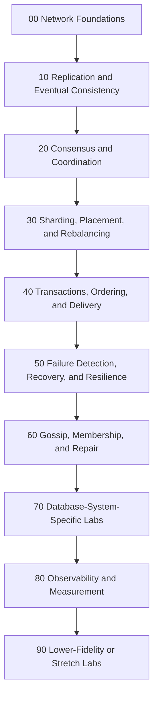
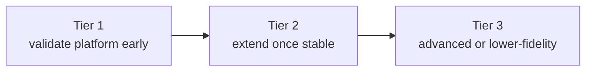
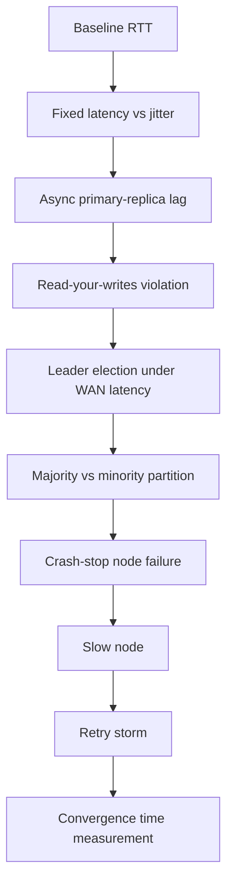

# Lab Catalog

This is the recommended lab inventory for the project. Not every lab should be implemented first. The goal is to design a catalog broad enough to support progressive learning.

## Catalog Map

## How to Read This List

- `Tier 1`: should exist early because they validate the platform and teach core concepts.
- `Tier 2`: good next labs once the platform is stable.
- `Tier 3`: advanced or lower-fidelity on a single-host lab.

## 00. Network Foundations

1. `Tier 1` Baseline RTT measurement
   Show measured RTT between regions before any workload-level experiment.
2. `Tier 1` Fixed latency vs jitter
   Compare steady delay with highly variable latency.
3. `Tier 1` Packet loss and retransmission
   Show throughput collapse and rising tail latency.
4. `Tier 1` Bandwidth-limited WAN link
   Demonstrate queueing and bandwidth-delay product effects.
5. `Tier 1` Asymmetric latency
   Make one direction slower than the reverse path.
6. `Tier 2` Packet reordering
   Show why ordered delivery assumptions break.
7. `Tier 2` Packet duplication
   Demonstrate duplicate request handling.
8. `Tier 2` Packet corruption
   Show checksum failure and retry behavior.
9. `Tier 2` Brownout link
   Intermittently degrade rather than fully partition a link.
10. `Tier 2` Partial partition
    Drop traffic only between selected regions or roles.

## 10. Replication and Eventual Consistency

11. `Tier 1` Async primary-replica lag
    Write to leader, read from follower, observe stale reads.
12. `Tier 1` Read-your-writes violation
    Show session inconsistency after a successful write.
13. `Tier 1` Monotonic reads failure
    Show a client observing older values across regions.
14. `Tier 1` Replica catch-up after outage
    Measure convergence time after a node returns.
15. `Tier 1` Sync vs async replication tradeoff
    Compare latency and durability/visibility.
16. `Tier 2` Multi-primary conflict creation
    Generate concurrent writes in different regions.
17. `Tier 2` Last-write-wins anomaly
    Show lost intent despite eventual convergence.
18. `Tier 2` Vector clock conflict detection
    Surface concurrent updates explicitly.
19. `Tier 2` CRDT counter convergence
    Demonstrate conflict-free merging after partition healing.
20. `Tier 2` Anti-entropy repair
    Run periodic repair and compare recovery time.
21. `Tier 2` Hinted handoff
    Queue writes during node outage and replay them later.
22. `Tier 2` Divergent replicas under partial visibility
    Show inconsistent state across regions before repair.

## 20. Consensus and Coordination

23. `Tier 1` Leader election under WAN latency
    Show how election time changes with geography.
24. `Tier 1` Leader failover
    Kill the leader and measure recovery time.
25. `Tier 1` Majority vs minority partition
    Show which side continues serving writes.
26. `Tier 1` Loss of quorum
    Show unavailability despite healthy minority nodes.
27. `Tier 1` Log replication delay
    Observe commit lag across followers.
28. `Tier 2` Split vote due to timeout tuning
    Show unstable elections with poor parameters.
29. `Tier 2` False failure detection under jitter
    Compare aggressive and conservative timeouts.
30. `Tier 2` Membership change in a Raft cluster
    Add or remove a node and observe reconfiguration.
31. `Tier 2` Learner or non-voting replica behavior
    Show read scaling without quorum impact.
32. `Tier 3` Lease-based reads and clock sensitivity
    Useful, but lower fidelity on a single host.

## 30. Sharding, Placement, and Rebalancing

33. `Tier 1` Consistent hashing node join
    Add a node and observe minimal movement.
34. `Tier 1` Consistent hashing node leave
    Remove a node and observe ownership transfer.
35. `Tier 1` Replication factor vs fault tolerance
    Compare write survival under failures.
36. `Tier 2` Hot partition
    Drive skewed traffic and show hotspot impact.
37. `Tier 2` Rebalancing under load
    Add capacity while traffic continues.
38. `Tier 2` Region-aware replica placement
    Show latency vs durability tradeoff.
39. `Tier 2` Repair traffic amplification
    Measure network cost of healing.
40. `Tier 3` Anti-entropy using Merkle trees
    Good advanced storage lab if implemented later.

## 40. Transactions, Ordering, and Delivery Semantics

41. `Tier 1` Idempotency under retries
    Show why duplicate-safe writes matter.
42. `Tier 1` Duplicate message delivery
    Demonstrate at-least-once semantics.
43. `Tier 1` Out-of-order event delivery
    Show consumer-side ordering assumptions failing.
44. `Tier 2` Exactly-once myth lab
    Demonstrate why end-to-end exactly-once is narrow and expensive.
45. `Tier 2` Two-phase commit coordinator failure
    Show blocking behavior and recovery complexity.
46. `Tier 2` Saga compensation
    Compare operationally with 2PC.
47. `Tier 2` Causal ordering vs total ordering
    Show where each is sufficient.
48. `Tier 3` Snapshot isolation anomalies in geo-distributed SQL
    Useful when Cockroach-style labs are added.

## 50. Failure Detection, Recovery, and Resilience

49. `Tier 1` Crash-stop node failure
    Kill a node and observe system behavior.
50. `Tier 1` Pause vs crash
    Compare a frozen node with a dead node.
51. `Tier 1` Slow node
    Stress one node and observe timeouts and lag.
52. `Tier 1` Retry storm
    Show how client retries amplify outages.
53. `Tier 1` Circuit breaker
    Compare protected and unprotected clients.
54. `Tier 2` Cascading failure
    Induce saturation and watch neighboring services degrade.
55. `Tier 2` Bulkheading
    Isolate resources and compare blast radius.
56. `Tier 2` Load shedding
    Drop work intentionally to protect recovery.
57. `Tier 2` Rolling restart
    Measure availability during maintenance.
58. `Tier 2` Brownout vs blackout
    Compare degraded service with total failure.
59. `Tier 3` Flapping membership
    Useful for studying unstable environments and gossip.

## 60. Gossip, Membership, and Repair

60. `Tier 1` Gossip dissemination speed
    Measure how fast membership or state spreads.
61. `Tier 2` Failure detector sensitivity
    Compare thresholds under jitter and loss.
62. `Tier 2` Suspicion and false positive tradeoff
    Show detector tuning costs.
63. `Tier 2` Membership convergence after partition heal
    Observe reconciliation of cluster views.
64. `Tier 2` Hinted handoff plus repair
    Compare short outage vs long outage recovery.
65. `Tier 3` Gossip fanout tuning
    Explore traffic cost vs convergence.

## 70. Database-System-Specific Labs

66. `Tier 1` `etcd`: leader election and quorum loss
67. `Tier 1` `Redis`: async replication and failover lag
68. `Tier 2` `Cassandra`: consistency levels `ONE`, `QUORUM`, `ALL`
69. `Tier 2` `Cassandra`: hinted handoff and repair
70. `Tier 2` `CockroachDB`: regional latency impact on transactions
71. `Tier 2` `CockroachDB`: leaseholder locality effects
72. `Tier 2` `ZooKeeper`: observer nodes and quorum behavior
73. `Tier 3` `Kafka`: ISR shrink/expand under WAN faults
74. `Tier 3` `NATS/JetStream`: consumer redelivery and ordering

## 80. Observability and Measurement Labs

75. `Tier 1` Measuring failover time correctly
    Separate detection, election, and client recovery times.
76. `Tier 1` Measuring convergence time
    Track when replicas actually agree again.
77. `Tier 1` Stale read rate as a metric
    Move beyond "it eventually recovered."
78. `Tier 2` Correlating traces with network faults
    Show causal links between impairments and latency spikes.
79. `Tier 2` Tail latency amplification
    Compare median vs p99 vs p999 behavior.
80. `Tier 2` SLO burn during partitions
    Connect distributed failures to service reliability.

## 90. Lower-Fidelity or Stretch Labs

These are useful, but should be labeled clearly because Docker-on-one-host is a weaker model here.

81. `Tier 3` Clock skew and lease safety
82. `Tier 3` Time jumps and TTL expiry anomalies
83. `Tier 3` Disk stall simulation
84. `Tier 3` Disk corruption recovery
85. `Tier 3` Byzantine behavior

## Best Initial Labs

If you want the smallest high-value starting set, implement these first:

1. Baseline RTT measurement
2. Fixed latency vs jitter
3. Async primary-replica lag
4. Read-your-writes violation
5. Leader election under WAN latency
6. Majority vs minority partition
7. Crash-stop node failure
8. Slow node
9. Retry storm
10. Convergence time measurement

That set validates the platform and covers the core distributed systems ideas most learners need first.
